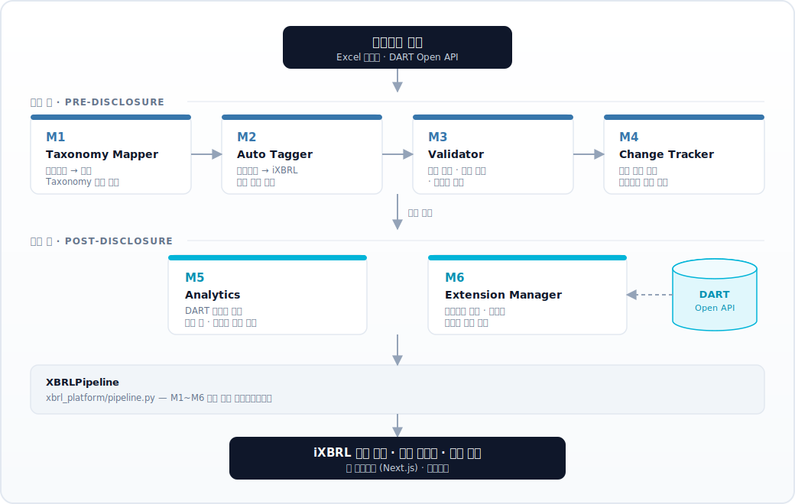

<p align="center">
  <h1 align="center">XBRL 공시 AI 자동화 플랫폼</h1>
  <p align="center">
    재무제표의 XBRL 공시 업무를 입력부터 분석까지<br/>
    End-to-End로 자동화하는 플랫폼
  </p>
</p>

<p align="center">
  <a href="https://xbrl-web.vercel.app">
    
  </a>
</p>

<p align="center">
  <sub>👆 클릭하면 새 탭에서 바로 열립니다 · <a href="https://xbrl-web.vercel.app">https://xbrl-web.vercel.app</a></sub>
</p>

<p align="center">
  
  
  
  
  
</p>

---

## Overview

재무제표의 XBRL 공시는 계정과목 매핑, iXBRL 태깅, 품질 검증, 변경사항 추적 등 사람 손이 많이 가는 반복 업무가 누적되는 고비용 프로세스입니다.

금융감독원의 재무공시 선진화 로드맵에 따라 상장사 XBRL 공시가 단계적으로 의무화되는 가운데, 이 프로젝트는 그 반복 업무를 **AI/규칙 기반으로 자동화**하여 입력부터 공시 후 분석까지 End-to-End로 처리하는 6개 모듈 플랫폼입니다.

### Key Capabilities

| 기능 | 설명 |
|------|------|
| **Taxonomy 자동 매핑** | 재무제표 계정과목을 KOR-IFRS 표준 Taxonomy 요소에 텍스트 유사도 기반으로 자동 매핑 |
| **iXBRL 자동 태깅** | 매핑 결과를 바탕으로 iXBRL 태그를 자동 생성·부착 |
| **공시 품질 검증** | 합산(Calculation) 불일치, 형식 오류, 전기 대비 이상치를 자동 탐지 |
| **변경사항 추적** | 전기/당기 XBRL 파일을 비교해 신규·삭제·금액변동 등 변경사항 자동 추출 |
| **재무 분석** | 기업 간·시계열 재무비율 비교·트렌드 분석 (현재 내장 샘플 데이터 기반 — 실제 DART 수집은 `run_real_data.py` 패턴으로 확장 예정) |
| **확장항목 표준화** | 기업별 확장항목을 수집·그룹핑하여 표준화 후보 제안 |
| **웹 인터페이스** | 기업 검색(DART 전체 등록법인 — **비상장 포함**) 또는 재무제표 업로드 → **iXBRL 생성·검증·변경추적**까지 웹에서 원스톱 처리. 연결(CFS) 재무제표가 없으면 별도(OFS)로 자동 전환하며, 구조화 데이터 미제출 법인(감사보고서만 공시)은 업로드 경로로 안내. 결과 iXBRL 파일을 바로 다운로드 |

> **하나의 엔진, 두 가지 실행 경로.** 웹 데모는 별도 로직을 재구현하지 않고, Python 코어 엔진(M1~M4)을 Vercel Python 서버리스 함수(`/api/process`)로 그대로 호출합니다. 즉 **배치 파이프라인과 웹이 동일한 엔진**을 공유하므로 결과가 항상 일치합니다.

---

## Architecture

<p align="center">
  
</p>

전체 흐름은 `xbrl_platform/pipeline.py`의 `XBRLPipeline` 클래스로 통합 실행됩니다.

### 모듈 상세

| 모듈 | 이름 | 기능 |
|------|------|------|
| **M1** | Taxonomy Mapper | 재무제표 계정과목을 KOR-IFRS 표준 Taxonomy 요소에 자동 매핑 (별칭 사전 + 텍스트 유사도, 임베딩 키 설정 시 의미 매칭) |
| **M2** | Auto Tagger | 매핑 결과를 바탕으로 iXBRL 태그를 자동 생성·부착 |
| **M3** | Validator | 합산(Calculation) 불일치, 형식 오류, 전기 대비 이상치 등 검증 |
| **M4** | Change Tracker | 전기/당기 XBRL 파일을 비교해 신규·삭제·금액변동 등 변경사항 추출 |
| **M5** | Analytics | 기업 간 재무비율 비교·트렌드 분석·대시보드 생성 (데모는 내장 샘플 데이터, 실제 DART 수집 연동은 로드맵) |
| **M6** | Extension Manager | 기업별 확장항목을 수집·그룹핑하여 표준화 후보 제안 |

### 매핑 신뢰도(Confidence) 이해하기

M1 결과의 **신뢰도**는 입력한 계정과목명이 표준 Taxonomy 요소와 **얼마나 잘 맞는지**를 0~100%로 나타낸 점수입니다(정확 일치·별칭 일치·과거 이력이면 100%). 다음 기준으로 색이 구분됩니다.

| 신뢰도 | 표시 | 의미 |
|--------|------|------|
| 80% 이상 | 🟢 | 신뢰 가능 (정확히/별칭으로 일치하면 100%) |
| 50~80% | 🟠 | 부분 일치 — 사람이 확인 권장 |
| 50% 미만 | 🔴 + `EXT` | 표준에 마땅한 요소 없음 → 확장항목(Extension) 후보 |

낮은 점수는 표준과 표현이 다르거나, 내장 표준 사전에 가까운 요소가 없을 때 나옵니다.

> ⚠️ **신뢰도가 높다고 항상 정확한 것은 아닙니다.** (단순 글자 유사도만으로는) 의미가 다른 요소에 붙을 수 있어, 높은 점수도 검토 대상입니다.

#### 매칭 엔진 개선 (적용 완료)

위 한계를 줄이기 위해 매칭을 다음과 같이 **하이브리드**로 고도화했습니다.

1. **별칭(동의어) 사전**: 표준 요소마다 DART 등에서 쓰이는 한글 표현을 등록(112개+). 예) `매각예정자산`→`매각예정비유동자산`, `종업원급여자산`→`순확정급여자산`, `관계기업투자`→`관계기업및공동기업투자`. 표현이 달라도 정확히 잡아내고, 과거 잘못 붙던 `관계기업투자`(손익) 오매핑도 해결.
2. **Taxonomy 확충**: 자주 쓰이나 누락됐던 표준 요소 추가(`매출채권및기타채권`, `기타금융자산` 등) → 커버리지 향상.
3. **별칭·토큰 인지 텍스트 유사도**: 표준 레이블 + 별칭 전체에 대해 최고 점수를 채택.
4. **의미 기반 임베딩(옵션)**: `OPENAI_API_KEY`(또는 `EMBEDDING_API_KEY`) 환경변수를 설정하면, 텍스트 유사도와 임베딩 코사인 유사도를 결합한 **의미 매칭으로 자동 전환**됩니다(키가 없으면 위 1~3으로 동작). 모델을 서버리스에 올리지 않고 임베딩 API만 호출하므로 외부 패키지 의존성이 없습니다.

---

## Project Structure

```
.
├── xbrl_platform/               # Python 코어 엔진 (M1~M6 + 파이프라인)
│   ├── m1_taxonomy_mapper.py    #   계정과목 → 표준 Taxonomy 자동 매핑
│   ├── m2_auto_tagger.py        #   재무제표 → iXBRL 태그 자동 부착
│   ├── m3_validator.py          #   XBRL 파일 검증 및 오류 탐지
│   ├── m4_change_tracker.py     #   전기 대비 공시 변경사항 추적
│   ├── m5_analytics.py          #   DART 데이터 기반 재무 분석
│   ├── m6_extension_manager.py  #   확장항목 수집·표준화 제안
│   ├── pipeline.py              #   M1~M6 통합 파이프라인
│   ├── run_real_data.py         #   DART 실제 데이터 실행 스크립트
│   ├── data/                    #   KOR-IFRS Taxonomy 데이터셋 (101개 요소 + 131개 별칭)
│   ├── skills/                  #   모듈별 스킬 정의
│   ├── utils.py
│   └── requirements.txt
│
├── tests/                       # pytest 단위 테스트 (M1~M4)
│
├── xbrl-web/                    # Next.js 웹 + Vercel Python 서버리스 엔진
│   ├── app/
│   │   ├── page.js, demo/, layout.js
│   │   └── api/dart/            #   DART API 프록시 라우트 (Next.js)
│   ├── api/
│   │   ├── process.py          #   ★ 코어 엔진 호출 엔드포인트 (Python 서버리스)
│   │   └── _engine/            #   xbrl_platform M1~M4 + Taxonomy 데이터 (vendored)
│   ├── vercel.json             #   서버리스 함수 + includeFiles 설정
│   └── requirements.txt        #   (엔진은 stdlib 전용 — 외부 의존성 없음)
│
├── .env.example                # 환경변수 템플릿
└── docs/
    └── architecture.svg        # 시스템 아키텍처 다이어그램
```

---

## How It Works

### 1. 공시 전 처리 (M1 → M4)

```
재무제표 입력 (Excel / DART)
  ↓
[M1] 계정과목 → 표준 Taxonomy 자동 매핑 (텍스트 유사도)
  ↓
[M2] 매핑 결과 → iXBRL 태그 자동 생성·부착
  ↓
[M3] 합산 검증 · 형식 오류 · 전기 대비 이상치 탐지
  ↓
[M4] 전기/당기 비교 → 신규·삭제·금액변동 추출
  ↓
iXBRL 공시 파일 + 검증 리포트 출력
```

### 2. 공시 후 분석 (M5 · M6)

```
DART Open API 수집
  ↓
[M5] 기업 간 재무비율 비교 · 시계열 트렌드 분석
[M6] 기업별 확장항목 수집·그룹핑 → 표준화 후보 제안
  ↓
웹 대시보드 (Next.js) / 다운로드
```

### 3. 웹 실행 동선 (브라우저 → 엔진)

```
[브라우저]  기업 검색(DART) 또는 엑셀/CSV 업로드
   │        (DART 응답에서 당기·전기 데이터 동시 추출)
   ▼
POST /api/process   ──►  [Vercel Python 서버리스 = 코어 엔진]
   │                       M1 매핑 → M2 iXBRL 생성 → M3 검증 → M4 변경추적
   ▼
[브라우저]  매핑/검증/변경추적 결과 표시 + iXBRL(.html) 다운로드
```

---

## Tech Stack

| Layer | Technology | Purpose |
|-------|-----------|---------|
| **Core Engine** | Python (표준 라이브러리 전용, 외부 의존성 없음) | 매핑·태깅·검증·추적 로직 |
| **Engine API** | Vercel Python Serverless (`/api/process`) | 브라우저에서 코어 엔진 직접 호출 |
| **Frontend** | Next.js 14, React 18 | 기업 검색·업로드·결과 시각화 UI |
| **DART Proxy** | Next.js API Route (`/api/dart`) | DART API 프록시 엔드포인트 |
| **Data Source** | DART Open API (금융감독원) | 상장사 재무제표 데이터 소스 |
| **Deploy** | Vercel | 프론트엔드 + Python 서버리스 함수 통합 배포 |

> 코어 엔진은 `requests` 등 외부 패키지 없이 Python 표준 라이브러리만 사용합니다. 덕분에 콜드스타트가 가볍고 Vercel 서버리스로 그대로 배포됩니다. (`requests`는 DART 실데이터 수집 스크립트 `run_real_data.py`에서만 사용)

---

## Getting Started

### Prerequisites

- Python 3.9+
- Node.js 18+
- DART Open API 인증키 ([발급 링크](https://opendart.fss.or.kr))

### 1. 환경변수 설정

```bash
cp .env.example .env
# .env 파일을 열어 DART_API_KEY 값을 입력
```

### 2. Python 코어 엔진

```bash
cd xbrl_platform
pip install -r requirements.txt

# 샘플 데이터로 전체 파이프라인 실행
python pipeline.py

# DART 실제 상장사 데이터로 실행
export DART_API_KEY=발급받은_키   # Windows: set DART_API_KEY=...
python run_real_data.py
```

### 3. 웹 데모 (Next.js + Python 서버리스)

웹은 프론트엔드(Next.js)와 코어 엔진(Python 서버리스 `/api/process`)으로 구성됩니다.
엔진 함수까지 함께 실행하려면 **`vercel dev`** 를 사용하세요. (일반 `next dev`는 Python 함수를 실행하지 않습니다.)

```bash
cd xbrl-web
npm install
npm i -g vercel          # 최초 1회
export DART_API_KEY=발급받은_키
vercel dev               # http://localhost:3000 (프론트 + /api/process 동시 구동)
```

> 엔진 없이 UI만 빠르게 보려면 `npm run dev` 도 가능하지만, `/api/process` 호출은 배포 환경 또는 `vercel dev` 에서만 동작합니다.

### 테스트 실행

```bash
pip install pytest
pytest tests/ -v
```

M1 매핑(정확·별칭·저신뢰), M2 태깅(이스케이프·컨텍스트 격리), M3 검증 규칙(BS 균형·합산),
M4 변경추적(신규·삭제·중요성)을 커버하며, GitHub Actions에서 push마다 자동 실행됩니다.
CI는 코어 엔진과 `xbrl-web/api/_engine` vendored 복사본의 동기화 여부도 함께 검사합니다.

---

## Deployment (Vercel)

이 프로젝트는 **Vercel** 한 곳에 프론트엔드와 Python 서버리스 엔진을 함께 배포합니다.

1. 코드를 GitHub 저장소에 push 합니다.
2. [Vercel](https://vercel.com) 에서 **New Project → Import** 로 해당 저장소를 가져옵니다.
3. **Root Directory** 를 `xbrl-web` 으로 지정합니다. (Framework Preset은 Next.js 자동 감지)
4. **Settings → Environment Variables** 에 `DART_API_KEY` 를 등록합니다. (선택) 의미 기반 매핑을 켜려면 `OPENAI_API_KEY` 도 등록하면 됩니다.
5. **Deploy** 를 누르면 빌드 후 공개 URL이 발급됩니다.

`xbrl-web/vercel.json` 이 `api/process.py` 를 Python 서버리스 함수로 등록하고,
`includeFiles` 로 코어 엔진(`api/_engine/**`)과 Taxonomy 데이터를 함께 번들링합니다.

CLI로 배포하려면:

```bash
cd xbrl-web
vercel            # 프리뷰 배포
vercel --prod     # 프로덕션 배포
```

---

## Security

- API 키 등 민감정보는 코드에 하드코딩하지 않고 **환경변수(`.env`)로 관리**합니다. `.env`는 `.gitignore`에 포함되어 커밋되지 않습니다.
- 저장소를 공개로 운영할 경우 발급 키가 노출되지 않도록 주의하세요.

---

## Glossary

| 용어 | 설명 |
|------|------|
| **XBRL** | 기업 재무정보를 컴퓨터가 읽을 수 있게 만드는 국제 표준 언어 |
| **iXBRL** | 사람이 읽는 HTML 안에 XBRL 태그를 내장한 형식 |
| **Taxonomy** | 재무정보 분류체계(사전). 각 항목이 어떤 표준 코드인지 정의 |
| **Tagging** | 재무제표 항목에 XBRL 표준 코드를 연결하는 작업 |
| **DART** | 금융감독원 전자공시시스템 |

---

## License

This project is licensed under the MIT License.

*본 프로젝트는 XBRL 공시 업무 자동화 가능성을 검증하기 위한 연구·학습용 구현입니다.*
